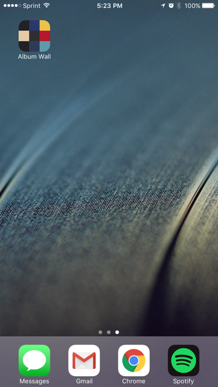
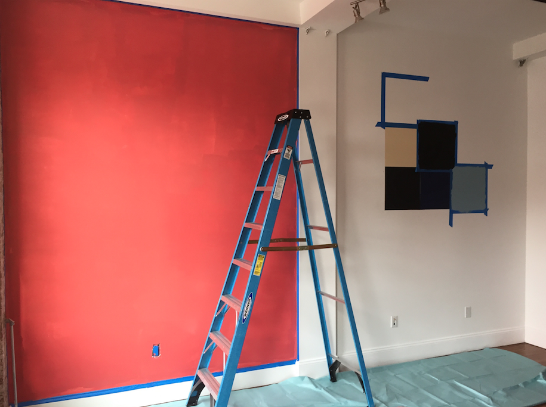
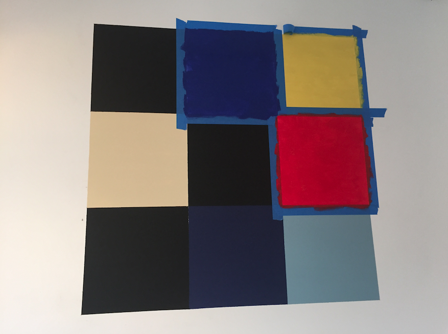
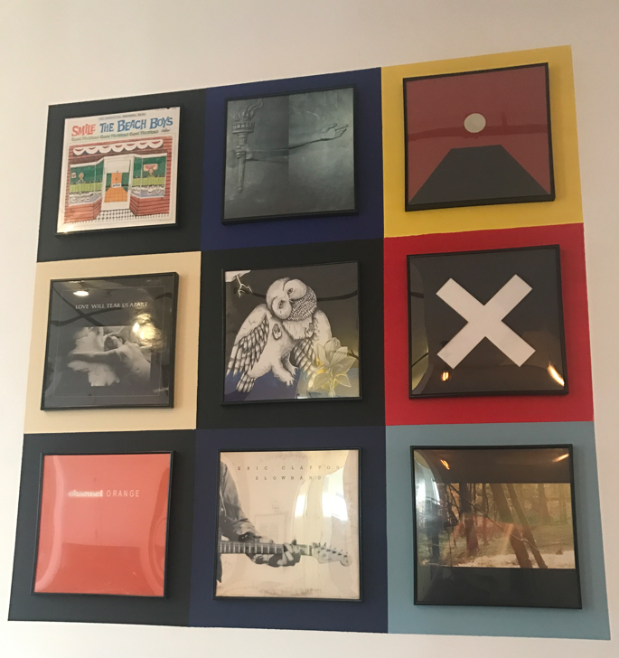

# AlbumWall

`AlbumWall` is an interactive art project I put together over several months. I was at the Tate Modern in August, 2016 and saw Ellsworth Kelly's [Méditerranée](http://www.tate.org.uk/art/artworks/kelly-mediterranee-l02465). Inspired by the colors, I decided that I would appropriate the work by painting the same grid on my wall in Brooklyn, then mounting records on each of the squares.

Over time I began to think that this could be a bit more interesting if it were interactive. If you're in my apartment and have the app installed, you can listen to any of the albums on the wall by simply pressing on the cover art within the app. Here's a [video (coming soon)](http://ux.stackexchange.com/questions/98872/best-way-to-display-a-coming-soon-link) of the app in action. 

## Usage

The build assumes an instance of [node-sonos-http-api](https://github.com/jishi/node-sonos-http-api) is running at the address `192.168.1.151` in order to interact with the Sonos system. This obviously needs to be changed, and I will soon run a local Raspberry Pi with a static address to interact with Sonos at a later stage. Run the following to set up the server:

    git clone git@github.com:jishi/node-sonos-http-api.git
    cd node-sonos-http-api
    npm install --production
    npm start

### Development

Follow the usual steps to build a React Native project for iOS:

    brew install node
    brew install watchman
    npm install -g react-native-cli
    react-native run-ios

## TODO

  * Make the `node-sonos-http-api` address configurable.
  * Add tests (I know, should've been done first, but it's a hacked together art project)
  * Android support?
  * Different actions for album short press/long press.
    * Long press to trigger menu providing album metadata, chosing whether to play 'featured' track vs. entire album.